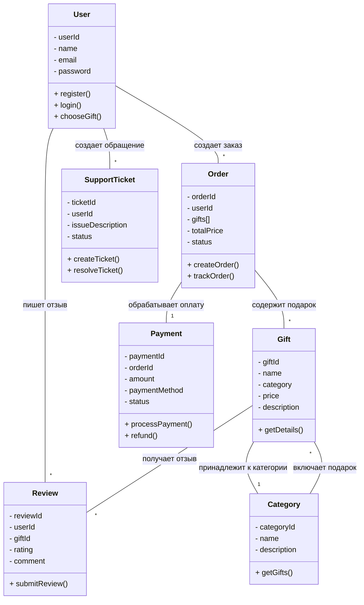
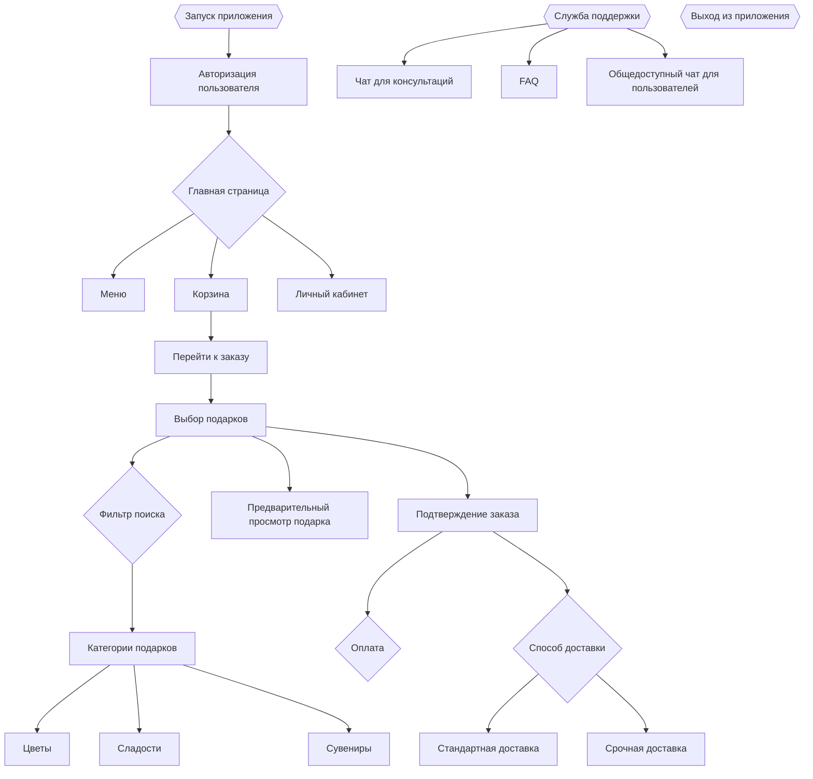
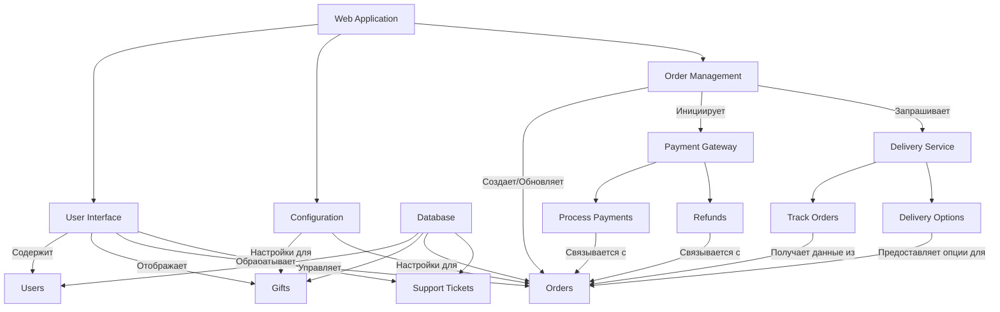

Тема: Персонализированная доставка подарков  
====

Причина разработки  
----

В современном мире люди все чаще ищут уникальные и персонализированные подарки для особых случаев. Однако выбрать идеальный подарок бывает сложно из-за нехватки времени или идей. Проект "Персонализированная доставка подарков" призван облегчить этот процесс, предоставляя пользователям удобную платформу для выбора и кастомизации подарков, которые будут доставлены прямо к двери получателя.  
----

Требования к проекту  
1. Интерфейс конфигуратора:  
  - Удобный и интуитивно понятный интерфейс для выбора и настройки подарков.  
  - Фильтр поиска для подбора подарков в зависимости от бюджета и предпочтений.  
  - Возможность выбора из различных категорий подарков (цветы, сладости, сувениры и т.д.).  
    - Цветы  
    - Сладости  
    - Сувениры  
  - Информация о значении и символике каждого подарка.  
  - Рекомендации по подаркам для разных случаев (день рождения, свадьба, благодарность и т.д.).  

2. База данных:  
  - Обновляемая база данных подарков с актуальными ценами и доступностью.  
  - Возможность добавления новых товаров и удаления устаревших.  

3. Система заказов:  
  - Функционал для оформления заказа и выбора способа доставки.  
  - Поддержка различных методов оплаты (карты, электронные кошельки).  
  - Возможность добавить персонализированное сообщение или открытку к подарку.  

4. Служба поддержки:  
  - Чат или телефонная линия для консультаций по выбору подарков.  
  - FAQ для решения распространённых вопросов.  

5. Логистика:  
  - Выбор способов доставки, включая стандартную и срочную доставку.  
  - Налаженная система доставки подарков.  
  - Возможность отслеживания статуса заказа по номеру трекера.  

6. Безопасность:  
  - Защита пользовательских данных и информации о платежах.  
  - Соответствие стандартам безопасности и конфиденциальности.  

7. Маркетинг:  
  - Разработка стратегии продвижения проекта (социальные сети, реклама, партнерства).  
  - Создание контента для привлечения целевой аудитории (обзоры, идеи подарков, истории покупателей).  

----

Диаграмма классов  

Демонстрация структурной системы для веб-приложения, связанного с конфигурацией и заказом подарков.  
- Пользователь может создавать множество заказов и отзывов.  
- Заказ может содержать множество подарков и связан с одним платежом.  
- Подарок может иметь множество отзывов и принадлежит к одной категории.  
- Категория может включать множество подарков.  

----

Диаграмма Активностей  

Описание последовательности действий пользователя в веб-приложении, включая выбор подарков, оформление заказа и доступ к службе поддержки.  

----

Диаграмма компонентов  

Здесь иллюстрируется, как различные компоненты приложения связаны друг с другом и как они обрабатывают данные пользователей и заказы.  
- UI управляет и отображает данные из базы данных.  
- Конфигурация влияет на настройки подарков и заказов.  
- Управление заказами инициирует процессы платежей и запросы к службе доставки.  
- Платежная система и служба доставки взаимодействуют с заказами для их обработки и отслеживания.  

